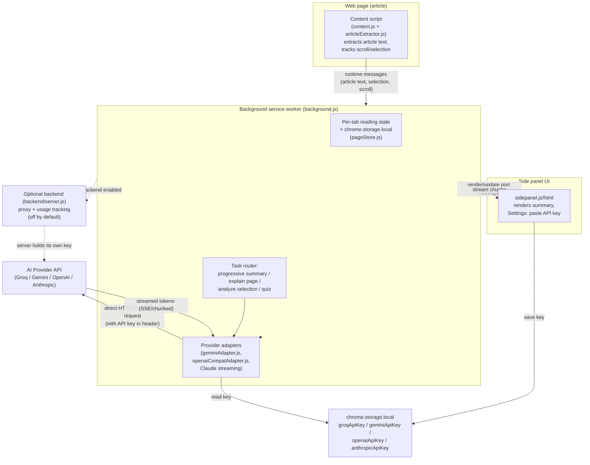

# Distill

Chrome side panel that summarizes long articles as you scroll, explains highlights, and uses **your** API key — no Distill server in the middle unless you opt in.

| | |
| --- | --- |
| **Author** | [Rahil Sheth](https://github.com/rsheth8) |
| **Repo** | [rsheth8/distill](https://github.com/rsheth8/distill) |
| **Stack** | Chrome Extension Manifest V3 (vanilla JS), optional Node/Express backend |
| **Status** | Load-unpacked / BYOK. Packaged Web Store build is BYOK-only; hosted backend is off by default. |

## What this is

Distill is a browser side panel that sits next to whatever article you're reading. Instead of scrolling through a wall of text, you get:

- A running summary that fills in as you scroll (so you always know what you've read and what's left).
- The ability to select any confusing sentence or paragraph and ask "explain this" or "analyze this highlight."
- A one-click "explain this page" that summarizes the whole article.
- Optional comprehension check-ins (light quizzes) to keep you engaged with long reads.
- Reading time estimates and a "focus mode" that visually declutters the page.

The key idea is **bring-your-own-key (BYOK)**: Distill doesn't run its own AI service that you have to trust with your reading habits. You get a free API key from a provider (Groq by default, or Gemini, OpenAI, Anthropic), paste it into Distill's settings once, and from then on your browser talks directly to that provider's API. The article text you're reading is sent straight from your machine to the AI provider — there is no Distill-owned server sitting in between reading your data, unless you deliberately opt into the optional self-hosted backend (useful for sharing one API budget across a team, or for people who don't want to manage their own key).

## Key features

- **Progressive summaries** — the article is broken into "reading units" (roughly paragraph-sized chunks) and summarized incrementally as the reader scrolls, rather than all at once.
- **Highlight analysis** — select text on the page and ask the AI to explain, define, or analyze it in the side panel.
- **Explain this page** — a single command that extracts the whole article and asks the AI for an overview.
- **Analyze selection** — keyboard-driven explanation of whatever text is currently selected.
- **Focus mode** — dims/hides page chrome to reduce distraction while reading.
- **Comprehension check-ins ("quiz mode")** — occasional short questions about what was just read.
- **Per-page state persistence** — reading progress, summaries, and highlights for a page are cached locally (`chrome.storage.local`) so returning to an article restores where you left off.
- **Multiple AI providers** — Groq (default, free tier), Google Gemini, OpenAI, and Anthropic Claude, selectable in Settings, each with its own stored key.
- **Optional hosted/self-hosted backend** — an Express API (`backend/`) that can proxy AI calls and track usage/quota server-side, for teams or users who don't want to manage a personal key. Off by default in the Chrome Web Store build.
- **Keyboard shortcuts** — open the reader, toggle focus mode, explain the page, or analyze a selection without touching the mouse.

## How it works

**Extension components (Manifest V3):**

- **Content script** (`extension/content.js` + `extension/utils/articleExtractor.js`) — injected into every HTTP(S) page. It locates the main article element (via common selectors like `article`, `[itemprop="articleBody"]`, or by falling back to the largest paragraph-dense block on the page), segments it into paragraph-level "reading units," tracks scroll position to know which unit the reader is currently on, and lets the reader select text to send for analysis. It communicates with the background service worker via `chrome.runtime` messaging.
- **Background service worker** (`extension/background.js`, ~3000 lines — the hub of the extension) — owns per-tab reading state, decides whether to call an AI provider directly or via the optional backend, builds the prompts/messages for each task (progressive summary, explain page, analyze selection, quiz), streams AI responses back to the UI, and persists reading state to `chrome.storage.local` (see `extension/utils/pageStore.js`) keyed by a hash of the page URL.
- **Side panel UI** (`extension/sidepanel.html/.js/.css`) — the reading pane the user actually looks at. It renders the streaming summary/explanation, lets the user manage the API key and provider settings, shows connection/backend status, and communicates with the background worker over a long-lived `chrome.runtime.connect` port plus one-off messages.
- **Provider adapters** (`extension/utils/geminiAdapter.js`, `extension/utils/openaiCompatAdapter.js`, and inline Claude streaming logic in `background.js`) — thin wrappers that translate a common `{systemPrompt, messages}` shape into each provider's streaming HTTP API (Anthropic Messages API, Gemini generateContent, and the OpenAI-compatible chat-completions format shared by Groq/OpenAI).

**The BYOK API key flow:**

1. In the side panel's Settings, the user picks a provider (Groq/Gemini/OpenAI/Anthropic) and pastes an API key into an input field (`apiKeyInput` in `sidepanel.js`).
2. The key is saved into `chrome.storage.local` under a provider-specific key (`groqApiKey`, `geminiApiKey`, `openaiApiKey`, `anthropicApiKey`) — never sent to any Distill-controlled server.
3. When an AI task runs, `background.js` reads the active provider and its key with `getProviderKey(provider)`, then calls the matching adapter (`streamClaude`, `streamGemini`, or `streamOpenAiCompat`), which attaches the key as the provider's expected auth header (`x-api-key` for Anthropic, `x-goog-api-key` for Gemini, `Authorization: Bearer` for OpenAI-compatible endpoints) and streams the response directly from the browser to the provider's API.
4. If the user has instead enabled the optional backend (self-hosted or hosted), requests go to `POST /v1/ai/run` on that backend with a short-lived bearer token instead of the provider key, and the backend holds its own server-side provider key. This path is off by default in the packaged extension.

**End-to-end request path (BYOK, default mode):**



## Tech stack

- **Extension:** Vanilla JavaScript (no framework), Chrome Extension Manifest V3 APIs (`chrome.storage`, `chrome.runtime`, `chrome.sidePanel`, `chrome.scripting`, `chrome.tabs`, `chrome.alarms`, `chrome.commands`). Service worker background script, content script injection, and a side panel (not a popup) as the main UI surface.
- **Backend (optional):** Node.js + Express (`backend/server.js`), server-sent-event-style streaming (`backend/lib/llmStream.js`), file-based (`backend/data/state.json`) or Postgres-backed (via Supabase, `supabase/migrations/`) usage-state storage, deployable via Docker/`docker-compose.yml` or Fly.io (`backend/Dockerfile`, `backend/fly.toml`).
- **Testing/tooling:** Vitest (unit + integration tests in `tests/`), `happy-dom` for DOM-dependent unit tests, ESLint (`eslint.config.mjs`), custom Node scripts for smoke tests, extension packaging, and an evaluation matrix against live provider APIs (`scripts/eval/`).
- **AI providers integrated:** Groq, Google Gemini, OpenAI, Anthropic Claude — all via direct HTTPS streaming calls from the browser (or proxied through the optional backend).

## Project structure

```
extension/                 Chrome extension (MV3)
  manifest.json            Permissions, content scripts, side panel, commands
  background.js            Service worker: state, task routing, AI streaming, backend proxy
  content.js                Article detection, scroll tracking, selection handling
  sidepanel.html/.js/.css  Side panel UI: summary rendering, Settings, API key entry
  backend-help.html        Dev-only help page for local backend setup
  utils/
    articleExtractor.js     Finds the main article element on a page
    geminiAdapter.js         Gemini streaming adapter
    openaiCompatAdapter.js   Shared adapter for Groq/OpenAI-style chat-completions APIs
    pageStore.js             Pure helpers for per-page save/restore state (unit tested)
    pageUrlKey.js            URL normalization/hashing for storage keys
    aiResultCache.js         In-memory/storage caching of AI results
    backendEnv.js            Resolves which backend base URL (prod/staging/local) to use
    buildConfig.js           Build-time flags (e.g. whether backend UI is included)
    exportClip.js            Export highlights/summaries as clips
    accentColor.js           UI accent color helper
backend/                   Optional Node/Express API for shared/hosted AI proxying
  server.js, lib/           HTTP routes, streaming, state storage
  Dockerfile, fly.toml      Container + Fly.io deploy config
supabase/                  Postgres schema + SQL queries for hosted usage dashboards
docs/                      API reference, deploy guide, privacy, store listing, metrics
scripts/                   Packaging (Web Store zip), smoke tests, quality/cost eval matrix
tests/                     Vitest unit, DOM, and backend integration tests
```

## Setup / running locally

### Install the extension (BYOK mode, no backend needed)

1. Clone this repo.
2. Open `chrome://extensions` in Chrome, enable **Developer mode**, click **Load unpacked**, and select the `extension/` folder (the one containing `manifest.json`).
3. Open a long article, click the Distill icon (or use the `Alt+Shift+R` shortcut) to open the side panel.
4. On first use, get a free API key (default provider is Groq — [console.groq.com/keys](https://console.groq.com/keys)), paste it into the side panel's setup/Settings screen, and connect. AI calls now go directly from your browser to that provider.

### Run the test/quality suite

```bash
npm install
npm test          # eslint + smoke checks + vitest coverage
npm run pack       # builds dist/distill-<version>.zip (BYOK-only, for the Web Store)
```

Individual pieces: `npm run lint`, `npm run unit` (vitest), `npm run smoke`.

### Optional: run the backend locally

Only needed to test the shared/hosted-backend mode (self-hosted or team usage):

```bash
cp backend/.env.example backend/.env
# edit backend/.env: set BACKEND_SECRET (24+ chars) and a provider key (e.g. GEMINI_API_KEY)

npm install --prefix backend
npm start --prefix backend
```

The backend listens on `http://localhost:8787` by default (`curl http://localhost:8787/healthz` to check). Without `DATABASE_URL` it stores usage state in `backend/data/state.json`; with `DATABASE_URL` set it uses Postgres (see `supabase/migrations/`). In the extension, enable **Settings → Advanced → hosted backend** and point it at the local URL (dev builds only, controlled by `extension/utils/buildConfig.js`).

## Notable implementation details

- **No framework, deliberately small surface area.** The extension is plain JavaScript loaded via `importScripts` in the service worker (`background.js` pulls in `buildConfig.js`, `pageUrlKey.js`, `backendEnv.js`, `aiResultCache.js`, `geminiAdapter.js`, `openaiCompatAdapter.js`, `pageStore.js`) and plain `<script>` includes in the side panel — no bundler is required to load or run the extension.
- **Storage is URL-hash-keyed and capped.** `pageStore.js` keys per-page reading state by a stable FNV-1a hash of the normalized page URL, caps stored history to a fixed number of pages (`DISTILL_MAX_SAVED_PAGES = 60`) with a 45-day TTL, and caps individual field sizes (summary chars, highlight count, quiz history) to stay well under Chrome's storage quota.
- **The key never leaves the browser in BYOK mode.** Provider keys live only in `chrome.storage.local`; the streaming adapters attach them directly to outbound requests to the provider's own domain (Anthropic, Google, Groq, or OpenAI), so Distill's own infrastructure never sees them unless the user explicitly opts into the hosted backend path, which uses a separate short-lived bearer token instead.
- **Backend is fully optional and excluded from the public build.** `extension/utils/buildConfig.js` gates whether the backend/Advanced UI is even shown; the Web Store package produced by `npm run pack` is BYOK-only.
- **Offline resilience.** `background.js` maintains an offline job queue (`OFFLINE_QUEUE_KEY`) that dedupes and retries AI tasks (like "explain page") if they fail while the backend or network is unreachable, flushing them once connectivity returns.
- **Per-site preferences.** Users can force "backend-only" mode for specific origins (`SITE_PREFS_KEY`), useful for sites where they don't want their own key used.
- **Content script exclusions.** The content script deliberately does not run on sensitive Google properties (Gmail, Docs, Drive, Calendar, Meet, Chat) or AI console pages, to avoid interfering with those apps or extracting irrelevant/sensitive content.
