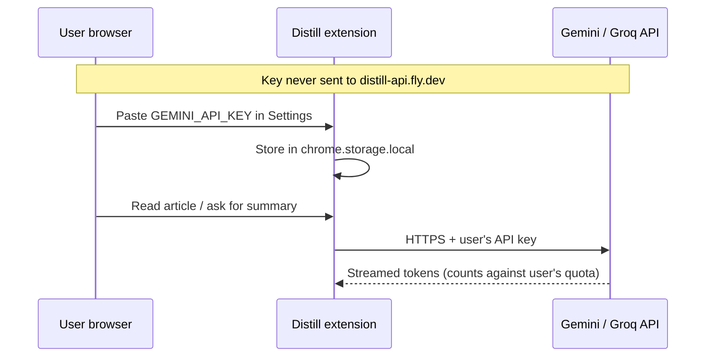

# Free LLM — two architectures

> **Status (v2.0.0):** Distill **ships Model B (per-user BYOK) as the default**, with
> **Gemini** as the default provider. Direct Gemini streaming, the prompt adapter,
> first-run onboarding, and the key-first Settings UI are all implemented. Model A
> (shared cloud) remains available behind the **Advanced → hosted backend** toggle for
> self-hosting. The historical notes below are kept for context.

Distill can use free LLM APIs in two **different** ways. Pick one product model; they solve different problems.

| | **A. Shared Distill cloud** (opt-in / self-host) | **B. Per-user API key (BYOK)** — **shipped default** |
|---|-----------------------------------------------|--------------------------------|
| Who pays / limits | One key on Fly; **your** provider quota + Distill **daily credits** per install | Each user’s **own** free-tier key; **their** Google/Groq RPM & RPD |
| User setup | None | User creates a free key (e.g. [AI Studio](https://aistudio.google.com/apikey)) and pastes in Settings |
| Where the key lives | Fly secrets only | `chrome.storage.local` on their machine only |
| Who runs AI | `distill-api.fly.dev` → provider | Browser → provider (or your server **must not** log their key) |
| Good for | “Install and go” | “I don’t want one shared quota for all users” |

**If every downloader must have their own API key and their own usage limits**, you want **Model B**, not a single `GEMINI_API_KEY` on Fly.

---

## Model B — how it works (per-user free tier)



1. **User** signs up for a free API key (Google AI Studio, Groq, etc.) — no card required on many free tiers.
2. **Extension** saves it locally (today: `anthropicApiKey` for Anthropic-only direct mode).
3. **Each AI request** uses **that user’s key**; rate limits apply **per Google/Groq project**, not shared with other Distill users.
4. **Your Fly backend** is optional: guest auth, sync, admin — but **not** required for AI if you disable cloud mode.

### What the repo supports today

| Piece | Status |
|-------|--------|
| Store user key in browser | **Yes** — Settings → AI key (per provider: `geminiApiKey` / `anthropicApiKey`) |
| Direct Anthropic from browser | **Yes** — `streamClaude` |
| Direct **Gemini** from browser | **Yes** — `streamGemini` via `extension/utils/geminiAdapter.js` |
| First-run onboarding + key validation | **Yes** — 2-step card + `VALIDATE_AI_KEY` |
| Default UX | **BYOK / Gemini** — `useBackendProxy` defaults `false`, `aiProvider` defaults `gemini` |

The BYOK Gemini model is **fully built and the default**. Model A (shared cloud) is the opt-in alternative.

### Sign in with Google (OAuth)

One-click UX without paste — see **[`GOOGLE_OAUTH.md`](GOOGLE_OAUTH.md)** for Chrome `identity` flow, scopes, consent screen, and **important quota caveats** (OAuth through your app often still shares *your* GCP quota unless you use a hybrid “sign in → create AI Studio key” flow).

### What you’d build for “free + per-user key” product

1. **Default off cloud** — `useBackendProxy` default `false`, or remove cloud toggle for public builds.
2. **Onboarding** — first-run: “Get a free Gemini key” → link to AI Studio → paste key.
3. **`streamGemini` in `extension/background.js`** — mirror `streamClaude`, call Generative Language API with user’s key (check Google’s browser/CORS rules; may need API restrictions by HTTP referrer).
4. **Settings UI** — label key as `GEMINI_API_KEY`, storage key e.g. `geminiApiKey` (migrate from `anthropicApiKey` or support both).
5. **Usage display** — show “Your Gemini quota” via provider dashboard link, not Distill daily credits (credits are a **shared-cloud** concept).
6. **Optional:** keep Fly only for non-AI features later; drop `ANTHROPIC_API_KEY` / `GEMINI_API_KEY` from Fly entirely.

### Privacy / security (BYOK)

- **Do not** POST the user’s API key to your backend for routine summaries unless you encrypt and never log it — users will not trust that, and you become liable for key leakage.
- **Do** keep keys in `chrome.storage.local` and call the provider from the extension (same pattern as current Anthropic direct mode).

### “Free” for you as the developer

- No LLM bill on Fly if users bring keys.
- You still pay for Fly + Supabase if you keep guest auth / usage DB.
- CI eval can use a **dedicated** test key in GitHub secrets (not user keys).

---

## Model A — shared cloud + one server key (previous doc)

One `GEMINI_API_KEY` (or Anthropic) on Fly serves **all** users. Distill enforces **per-install daily credits** in Postgres/file state — that is **your** fairness layer, **not** Google’s per-key limits.

Use this only if you want zero setup for users and accept shared provider quota + your hosting cost/abuse risk.

### Fly cutover (operator)

```bash
fly secrets set GEMINI_API_KEY="AIza..." LLM_PROVIDER="gemini" -a distill-api
```

See [Gemini pricing / limits](https://ai.google.dev/gemini-api/docs/pricing).

---

## Comparison summary

| Question | Model A (shared cloud) | Model B (per-user key) |
|----------|------------------------|-------------------------|
| Same API key for all users? | Yes | **No** — each user has their own |
| User gets provider’s free tier limits? | No — shared pool | **Yes** — per their account |
| User setup | None | Create key + paste once |
| Extension default today | **Yes** | No (must turn off cloud) |
| Best “free” for you | One free Gemini key on Fly (capped) | $0 LLM on Fly |

---

## Recommended direction (per your requirement)

**Product:** Model B — **BYOK Gemini (or Groq) as default**, cloud optional for power users or removed from public build.

**Roadmap (engineering):**

1. Extension: direct Gemini streaming + onboarding copy  
2. Default `useBackendProxy: false` for store build (or env flag in manifest)  
3. Docs: user-facing “Get your free API key”  
4. Fly: remove shared LLM secrets when you no longer need hosted AI  

---

## Checklist — Model B (per-user) — ✅ shipped in v2.0.0

- [x] Decide provider (Gemini free tier — default; Anthropic optional)
- [x] Implement `streamGemini` + per-provider storage key in extension
- [x] First-run setup UI (key required before AI) + inline validation
- [x] Turn off Distill cloud by default; update privacy copy
- [x] Remove/hide shared-cloud messaging in store listing (see `docs/STORE_LISTING.md`)
- [ ] (Optional) Strip LLM from Fly; keep backend only if needed for other features

## Checklist — Model A (shared cloud)

- [ ] Single `GEMINI_API_KEY` on Fly  
- [ ] Keep daily credits + rate limits  
- [ ] Users do not need keys  
