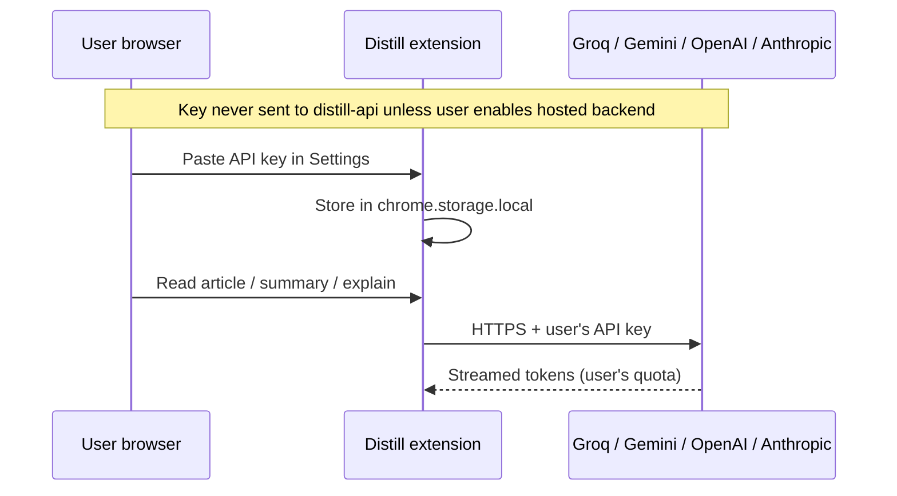

# Free LLM — two architectures

Distill supports two ways to run AI. **Model B (BYOK) is the shipped default** for the Web Store build (`npm run pack` strips the hosted-backend UI). **Model A (shared cloud)** remains in the repo for self-hosting via `backend/`.

| | **A. Shared Distill cloud** (opt-in / self-host) | **B. Per-user API key (BYOK)** — **default** |
|---|--------------------------------------------------|-----------------------------------------------|
| Who pays / limits | One key on Fly; **your** provider quota + Distill **daily credits** per install | Each user's **own** free-tier key; **their** provider RPM & RPD |
| User setup | None (if you operate the backend) | Free key from Groq / Gemini / etc. → paste in Settings |
| Where the key lives | Fly secrets only | `chrome.storage.local` on the user's machine |
| Who runs AI | Your `backend/` host → provider | Browser → provider directly |
| Good for | “Install and go” on your deployment | No shared quota; no LLM bill on your Fly app |

---

## Model B — BYOK (shipped)


```mermaid
sequenceDiagram
  participant User as User browser
  participant Ext as Distill extension
  participant LLM as Groq / Gemini / OpenAI / Anthropic

  Note over User,LLM: Key never sent to distill-api unless user enables hosted backend
  User->>Ext: Paste API key in Settings
  Ext->>Ext: Store in chrome.storage.local
  User->>Ext: Read article / summary / explain
  Ext->>LLM: HTTPS + user's API key
  LLM-->>Ext: Streamed tokens (user's quota)
```

**Default provider:** Groq (`llama-3.1-8b-instant`) — free tier, broad availability. Alternatives: Gemini, OpenAI (`gpt-4o-mini`), Anthropic.

**Implementation (extension):**

| Piece | Location |
|-------|----------|
| Provider routing | `extension/background.js` |
| Gemini adapter | `extension/utils/geminiAdapter.js` |
| OpenAI-compatible (Groq, OpenAI) | `extension/utils/openaiCompatAdapter.js` |
| First-run onboarding | `extension/sidepanel.js` |
| Web Store build (no backend UI) | `npm run pack` → `DISTILL_INCLUDE_BACKEND = false` |

Optional **Sign in with Google** notes: [`GOOGLE_OAUTH.md`](GOOGLE_OAUTH.md).

### Privacy / security (BYOK)

- Do **not** POST user API keys to your backend for routine summaries.
- Keys stay in `chrome.storage.local`; calls go straight to the provider (same-origin policy / provider CORS rules apply).

### “Free” for you as the developer

- No LLM bill on Fly when users bring keys.
- You still pay for Fly + Supabase if you run guest auth / usage DB.
- CI eval uses a dedicated key in GitHub secrets (`GEMINI_API_KEY` or `ANTHROPIC_API_KEY`), not user keys.

---

## Model A — shared cloud (self-host)

One `GEMINI_API_KEY` (or `ANTHROPIC_API_KEY`) on Fly serves **all** users. Distill enforces **per-install daily credits** in Postgres or `state.json` — your fairness layer, not the provider's per-user limits.

```bash
fly secrets set GEMINI_API_KEY="AIza..." LLM_PROVIDER="gemini" -a distill-api
```

See [Gemini pricing / limits](https://ai.google.dev/gemini-api/docs/pricing). Operator docs: [`backend/README.md`](../backend/README.md), [`DEPLOY.md`](DEPLOY.md).

---

## Comparison

| Question | Model A (shared cloud) | Model B (BYOK) |
|----------|------------------------|----------------|
| Same API key for all users? | Yes | **No** |
| User gets provider free-tier limits? | No — shared pool | **Yes** |
| Extension default (store build) | Hidden | **Yes** |
| Best “free” for you | One free Gemini key on Fly (capped) | **$0 LLM** on your infrastructure |
