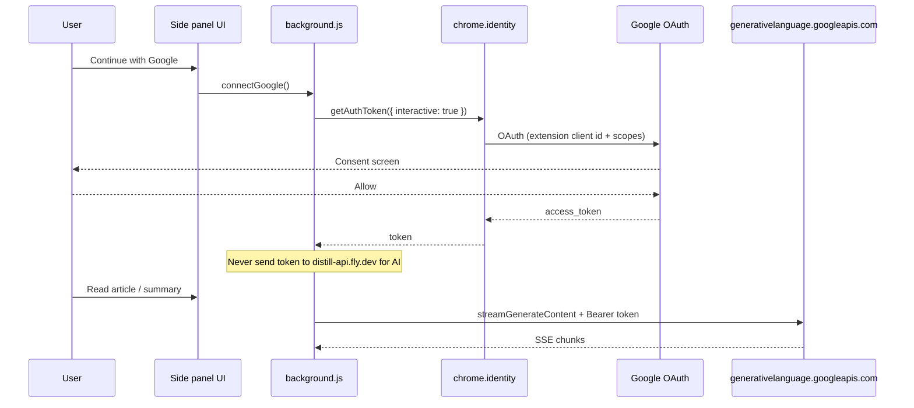

# Sign in with Google for Gemini (Distill)

How **OAuth** would work in Distill, what it does and does **not** solve, and how it compares to paste-an-API-key.

Related: [`FREE_LLM.md`](FREE_LLM.md) (per-user vs shared cloud).

---

## What the user experiences

1. User installs Distill and opens the side panel.
2. They see **“Continue with Google”** (not a long API key field).
3. Chrome opens a small Google sign-in / consent window (or uses an existing Chrome profile session).
4. User approves **“Distill wants to use Gemini on your behalf”** (wording you define on the consent screen).
5. Extension receives a short-lived **access token** (and Chrome may cache it).
6. AI requests run with `Authorization: Bearer <token>` to Google’s Generative Language API.
7. Later visits: **silent refresh** via `chrome.identity.getAuthToken({ interactive: false })` until the user revokes access or signs out.

That is the “one click, not zero” flow: one explicit consent, then mostly invisible renewals.

---

## Architecture (Chrome extension)



Distill today has **no** `identity` permission and **no** `oauth2` block in `manifest.json` — this is a greenfield addition.

### Pieces you register (one-time, you as developer)

| Item | Where |
|------|--------|
| Google Cloud **project** | [console.cloud.google.com](https://console.cloud.google.com) |
| Enable **Generative Language API** | APIs & Services |
| **OAuth consent screen** | External app, scopes, privacy policy URL |
| **OAuth client ID** type **Chrome extension** | APIs & Services → Credentials; bound to extension ID |
| `manifest.json` | `"permissions": ["identity"]`, `"oauth2": { "client_id": "….apps.googleusercontent.com", "scopes": [...] }` |

Official guides:

- [Chrome extension OAuth](https://developer.chrome.com/docs/extensions/how-to/integrate/oauth)
- [Gemini API OAuth quickstart](https://ai.google.dev/gemini-api/docs/oauth) (GCP / desktop flow; same API, different host than AI Studio keys)

### Code shape (service worker)

```javascript
// extension/utils/googleAuth.js (sketch)
async function getGoogleAccessToken({ interactive }) {
  return new Promise((resolve, reject) => {
    chrome.identity.getAuthToken({ interactive }, (token) => {
      if (chrome.runtime.lastError) reject(new Error(chrome.runtime.lastError.message));
      else resolve(token);
    });
  });
}

async function signOutGoogle() {
  const token = await getGoogleAccessToken({ interactive: false }).catch(() => null);
  if (token) {
    await new Promise((r) => chrome.identity.removeCachedAuthToken({ token }, r));
  }
}
```

Call AI (same SSE shape as backend Gemini adapter):

```javascript
const token = await getGoogleAccessToken({ interactive: true });
const url = `https://generativelanguage.googleapis.com/v1beta/models/gemini-2.0-flash:streamGenerateContent?alt=sse`;
const res = await fetch(url, {
  method: 'POST',
  headers: {
    'Content-Type': 'application/json',
    Authorization: `Bearer ${token}`,
    'x-goog-user-project': DISTILL_GCP_PROJECT_NUMBER // see quota section
  },
  body: JSON.stringify({ /* contents, generationConfig */ })
});
```

Use **`interactive: true` only from a button** — Google warns against prompting on cold install with no context.

---

## Critical: whose quota gets used?

This is the part that must be clear before you build.

| Auth method | Who pays / rate limits |
|-------------|-------------------------|
| **User’s AI Studio API key** (`x-goog-api-key`) | **That user’s** free tier (per Google account / key) |
| **Your one server API key** on Fly | **Your** shared quota |
| **OAuth via your extension’s client ID** + `x-goog-user-project: YOUR_PROJECT` | Usually **your GCP project’s** quota (shared across all signed-in users) |
| **OAuth + user’s own GCP project** | Per-user quota, but requires each user to have a Cloud project with billing/API enabled — **not realistic** for a consumer extension |
| **Google One / Code Assist OAuth** | Different endpoints (`cloudcode-pa.googleapis.com`), entitlements tied to subscriptions; **not** the simple AI Studio key path; fragile for third-party apps (see [gemini-cli issues](https://github.com/google-gemini/gemini-cli/issues/25627)) |

So: **“Sign in with Google” does not automatically mean each installer gets a separate AI Studio free-tier bucket** the way separate API keys do. It often means “users authenticate,” while **usage still counts against the GCP project that owns the OAuth client** (yours), unless Google exposes a documented per-user consumer quota through that token (today the well-supported consumer path is still **API keys in AI Studio**).

### Three product variants

| Variant | Per-user limits? | UX | Fit for Distill |
|---------|------------------|-----|-----------------|
| **A. OAuth + your GCP project** | No (shared) | Best sign-in UX | Same as Distill cloud, but tokens in browser instead of Fly |
| **B. OAuth + guided API key** | Yes | Sign in → open AI Studio (already logged in) → Create key → paste once | Matches your goal; OAuth is **convenience**, key is **quota** |
| **C. API key only (no OAuth)** | Yes | Paste key in Settings | Supported today (Anthropic only in direct mode) |

**Recommendation if per-user free limits are required:** target **B** or **C** for quota, optionally add Google sign-in for account features later.

**Hybrid B flow (best of both worlds):**

1. **Continue with Google** → `chrome.identity` (optional: store `email` scope for display only).
2. Open tab: `https://aistudio.google.com/apikey` (user already signed in).
3. In-extension: **“Paste your key”** or read clipboard once.
4. Store `geminiApiKey` in `chrome.storage.local`; call API with `x-goog-api-key` (true per-user quota).
5. Optional: remember “setup complete” flag so step 2–3 only runs once.

---

## Scopes (what to request)

Google’s [Gemini OAuth doc](https://ai.google.dev/gemini-api/docs/oauth) uses scopes such as:

- `https://www.googleapis.com/auth/generative-language.retriever` (retrieval / some flows)
- `https://www.googleapis.com/auth/cloud-platform` (broad; used in many GCP examples)

For **`generateContent`** from an extension you must:

1. List the **minimum** scopes on the consent screen.
2. Confirm in a spike that `streamGenerateContent` accepts the token from `chrome.identity` with your chosen scope (test with a throwaway extension ID).

Avoid `cloud-platform` unless you need it — it is very broad and triggers stricter review.

Also send **`x-goog-user-project`** when using Bearer tokens, per Google’s REST examples (project that owns quota/billing for the call).

---

## OAuth consent screen & publishing

| Stage | Who can sign in | Notes |
|-------|-----------------|-------|
| **Testing** | Test users you add in Cloud Console | Shows “Google hasn’t verified this app” — normal |
| **Production** | Any Google account | Requires verification if sensitive scopes; privacy policy, homepage |

Plan for:

- Privacy policy explaining article text sent to Google’s API
- Domain / support email on consent screen
- Possibly **100-user test cap** until verified

Chrome Web Store review may ask how you use Google user data.

---

## Security rules

| Do | Don’t |
|----|--------|
| Keep tokens in extension only (`chrome.identity` cache + optional encrypted storage) | Send user OAuth tokens to `distill-api.fly.dev` for routine summaries |
| Use `removeCachedAuthToken` on sign-out | Log tokens or put them in analytics |
| Request minimal scopes | Embed OAuth **client secret** in the extension (there isn’t one for Chrome extension clients — good) |
| Use HTTPS to `generativelanguage.googleapis.com` | Use `interactive: true` on every cold start |

If you later sync settings via your backend, sync **non-secret** prefs only (install id, mode), not LLM credentials.

---

## How this maps onto Distill’s codebase

| Layer | Today | With OAuth (variant A) | With hybrid B |
|-------|--------|-------------------------|---------------|
| `manifest.json` | No identity | Add `identity` + `oauth2` | Same |
| `background.js` | `streamViaBackend` / `streamClaude` | Add `streamGeminiOAuth` | Add `streamGeminiApiKey` |
| Default routing | Distill cloud on | `useBackendProxy: false`, require Google | Same + setup wizard |
| Fly backend | Hosts shared LLM key | Optional; AI can be extension-only | Optional |
| Settings UI | API key + cloud toggle | “Sign in with Google” + status | Google + one-time key paste |

Backend `llmStream.js` Gemini adapter is a useful reference for request/response/SSE parsing; the extension would duplicate that shape with Bearer or API key auth.

---

## Implementation phases (suggested)

### Phase 0 — Spike (1–2 days)

- [ ] Create GCP project + Chrome extension OAuth client (unpacked extension ID for dev; separate ID for store build if needed).
- [ ] Add `identity` permission; button calls `getAuthToken`.
- [ ] One `fetch` to `streamGenerateContent` from service worker; confirm 200 + stream.
- [ ] Document which scope + `x-goog-user-project` value worked.
- [ ] Decide A vs B vs hybrid based on **measured quota behavior**.

### Phase 1 — Product UX

- [ ] Setup screen: explain Google + article text.
- [ ] Connected state: show account email, Sign out.
- [ ] Wire `streamTask` to Gemini path when connected.
- [ ] Error mapping: 401 → re-auth; 429 → “Google rate limit” with link to AI Studio quotas.

### Phase 2 — Hardening

- [ ] Sign out clears tokens + cached keys.
- [ ] Offline / expired token handling (`interactive: false` then prompt).
- [ ] Privacy policy + consent screen for production.
- [ ] Tests: mock `chrome.identity` in vitest front project.

### Phase 3 — Optional

- [ ] Deprecate shared Fly LLM secrets for public users.
- [ ] Keep Fly for credits/sync only if needed.

---

## OAuth vs paste API key (summary)

| | Sign in with Google (OAuth) | Paste Gemini API key |
|--|----------------------------|----------------------|
| User friction | Low (one consent) | Medium (open AI Studio, copy) |
| Per-user free quota | **Often no** (shared project) unless hybrid | **Yes** |
| Token in extension | OAuth access token (short-lived) | Long-lived API key |
| Revocation | Google account permissions | User deletes key in AI Studio |
| Chrome APIs | `chrome.identity` | `chrome.storage.local` only |
| Works offline | No | No |

---

## FAQ

**Can OAuth run automatically on install?**  
You can call it on install, but Google recommends **not** using `interactive: true` without UI context. Use a setup screen.

**Does this replace the Fly backend?**  
For AI, yes, if all inference is client-side. You can still use Fly for non-LLM features.

**Is this free for you?**  
If quota is on **your** GCP project, you hit **your** free tier limits across all users. If each user uses **their** API key (hybrid B), your LLM cost is $0.

**Gemini vs Anthropic OAuth?**  
Anthropic does not offer the same “Sign in with Anthropic” consumer OAuth for extensions. Google is the natural fit for this pattern.

---

## Next step

Run **Phase 0 spike** and record: HTTP status, error body, and whether quota is per-user or per-project before committing the product to OAuth-only.

If you want this built in-repo next, say whether you prefer **variant A** (shared quota, simplest OAuth) or **hybrid B** (per-user quota, best match for your earlier requirements).
